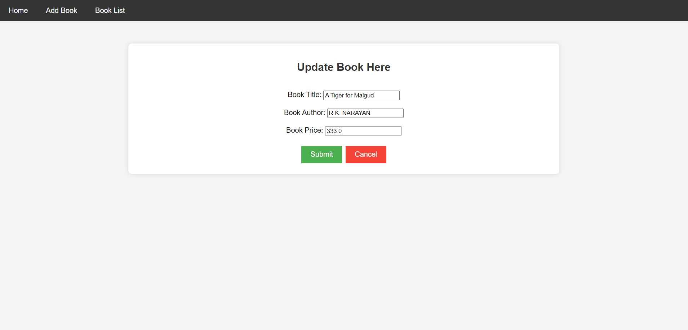
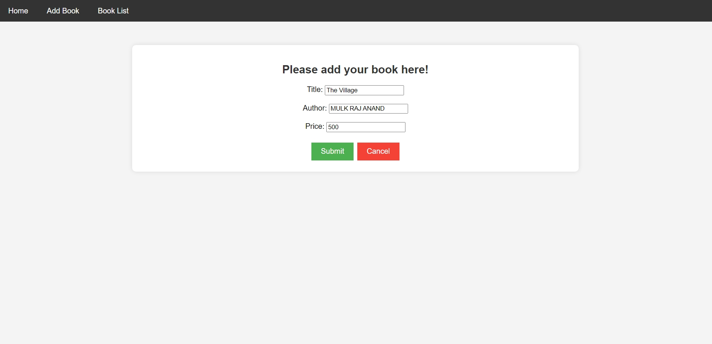
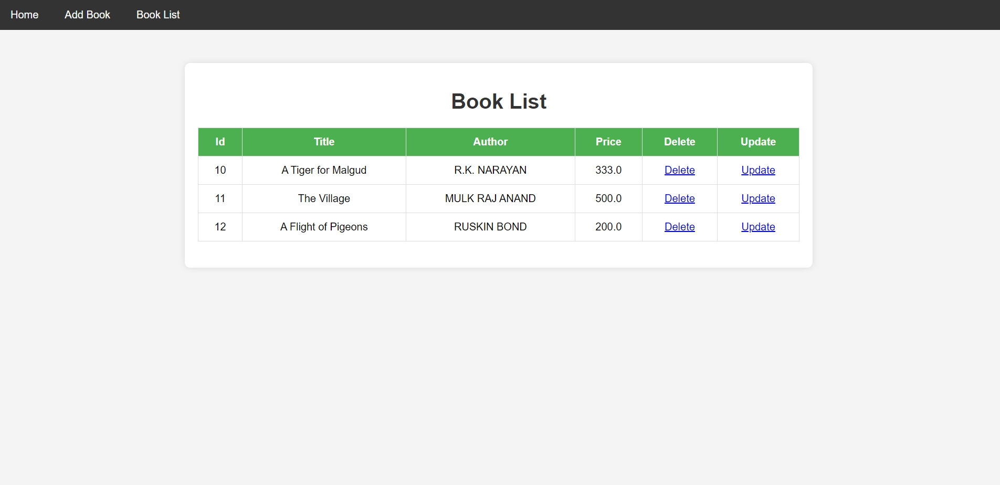

# Library Management System

## Overview

The Library Management System is a web application designed to manage books and their associated details. It provides functionality for adding, updating, and listing books, and features a user-friendly interface built with JSP and CSS. The application uses Hibernate for database interactions and follows a Model-View-Controller (MVC) pattern.

## Features

- **Add Book**: Allows users to add new books to the library.
- **Update Book**: Enables users to update details of existing books.
- **Book List**: Displays a list of all books in the library with options to delete or update each book.

## Technologies

- **Frontend**: HTML, JSP, CSS
- **Backend**: Java Servlets, Hibernate
- **Database**: MySQL

## Screenshots

### Update Page



### Add Book Page



### Book List Page



## Project Structure

```plaintext
src/
  main/java/com/configuration/    # Hibernate configuration classes
  main/java/com/entity/           # Entity classes (e.g., Book)
  main/java/com/servlet/          # Servlet classes for handling HTTP requests
  main/java/com/controller/       # Controller classes for business logic
  main/java/com/dao/              # DAO classes for database operations

webapp/
  css/                            # CSS files for styling
  WEB-INF/
    web.xml                       # Deployment descriptor file for configuring servlets
  index.jsp                       # Page for viewing the list of books
  add_book.jsp                     # Page for adding new books
  updateBook.jsp                  # Page for updating book details
